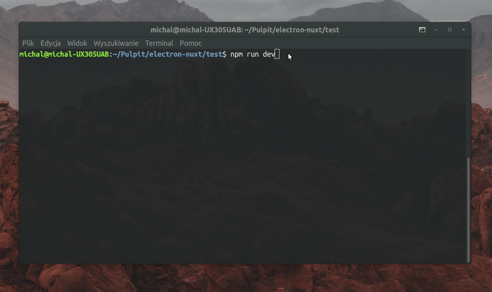

<div align="center">
<br>

<br>
<br>
</div>

<div align="center">

[](https://travis-ci.org/michalzaq12/electron-nuxt)
[](https://travis-ci.org/michalzaq12/electron-nuxt)
[](https://travis-ci.org/michalzaq12/electron-nuxt)

</div>

<div align="center">

[](https://standardjs.com)
[](https://www.codefactor.io/repository/github/michalzaq12/electron-nuxt)


</div>

<br>

## Overview

The boilerplate for making electron applications built with vue / nuxt.

**Things you'll find in this boilerplate:**

* Auto-updating for easy development \*
* ES6/ES7 compilation without any extra work \*
* Typescript support [WIP](only in renderer process for now)
* Parallel code compilation
* Installed latest [vue-devtools](https://github.com/vuejs/vue-devtools)
* Ability to easily package your electron app using [electron-builder](https://github.com/electron-userland/electron-builder)
* Configured ESLint ([`standard`](https://github.com/feross/standard) code style) with support for typescript linting\**
* Built-in support for CSS pre-processor: \**
    * Sass (scss)
    * LESS
    * Stylus
* Pre-installed UI components framework: \**
    * [Buefy](https://buefy.org)
    * [Vuetify](https://vuetifyjs.com/en/)
    * [Element](https://element.eleme.io/#/en-US)
* Pre-installed icon set for offline usage: \**
    * [Font Awesome 5](https://fontawesome.com/icons)
    * [Material Design Icon](https://materialdesignicons.com)
* Unit Testing \([vue-test-utils](https://vue-test-utils.vuejs.org) + [AVA](https://github.com/avajs/ava)\) \**
* End-to-end Testing \([Spectron](https://github.com/electron/spectron) + [AVA](https://github.com/avajs/ava)\) \** 

\* available in renderer and main process <br>
\** customizable during vue-cli scaffolding


## Getting Started

This boilerplate was built as a template for [vue-cli v2](https://www.npmjs.com/package/vue-cli) and includes options to customize your final scaffolded app.

### Scaffolding

```bash
npm install -g vue-cli
vue init michalzaq12/electron-nuxt <project-name>
```

> If you already have installed vue-cli >= 3, you will need to install global bridge *(since version 3.0 vue-cli package name has changed from vue-cli to @vue/cli)*:
>
> `npm install -g @vue/cli-init`
>
> `vue init` now works exactly the same as vue-cli@2.x

```bash
cd <project-name>
npm install
```


### Available commands

- Run app in development
    <details>
    <summary>Preview</summary>

    

    </details>
```bash
npm run dev
```
- Build your app for production
```bash
npm run build
```

<br>


# Documentation

## Renderer process

### Application structure

Same as [default Nuxt.js application structure](https://nuxtjs.org/guide/directory-structure/), but without **Static Directory**. If you don't want to use Webpack assets from the `assets` directory read section [static resources](#static-resources) and [resolving paths in HTML](#resolving-paths-in-HTML).

### Routing

Nuxt.js automatically generates the vue-router configuration based on your file tree of Vue files inside the `src/renderer/pages` directory.

[Read more](https://nuxtjs.org/guide/routing/)

###

## Main process

Entry point: `main/index.js`

> [`BrowserWinHandler`](https://github.com/michalzaq12/electron-nuxt/blob/master/template/src/main/BrowserWinHandler.js) is helper class, which wrap [`BrowserWindow`](https://electronjs.org/docs/api/browser-window) to make it more self-manageable. This solution facilitates communication between the windows and doesn't require a window manager.

## Resolving paths in HTML

If you would like to set the src of an `` to the path of an image, you must use `~/assets` Webpack alias or provide **absolute** path with **protocol** (required on Linux and Mac to proper work in development environment).

**Examples:**
- ``
- ``
- ```<script :src="`file:///${__resources}/ex_script.js`" /> ```

## Static resources

Electron-nuxt provides a global variable named `__resources` that will yield a proper path to the `src/resources` in renderer and main process. In this directory you can store all necessary resources with reliable path to them, but **you must treat all assets in this directory as read only.** (If you need also write access use [`app.getPath('appData')`](https://electronjs.org/docs/api/app#appgetpathname) instead of `__resources`).

**Use case:**
* [Tray icon](https://electronjs.org/docs/api/tray)
* External scripts
* Binary data

## Building notes

Electron-nuxt support [electron-builder](https://github.com/electron-userland/electron-builder) to build and distribute your production ready application. Further customization can be made in `builder.config.js` file.

### `dependencies` vs `devDependencies`

Due to [electron-builder](https://github.com/electron-userland/electron-builder) the distinction between `dependencies` and `devDependencies` is very important. Incorrect assignment can cause the package to grow by several MB, the build time also increases.

**Brief advice:** Try to avoid adding a package to `dependencies`.


**Explanation**

> If your package uses some modules only for build, test, or bundles them into a dist file (i.e. what will be used by the consumer project), then those modules should not be mentioned in dependencies. We still list them in devDependencies for development. [~ghybs](https://stackoverflow.com/a/50803712)

- packages mentioned in `dependencies` are packed into production build with all sub-dependencies *(this behavior can`t be configured)*.

- packages mentioned in `devDependencies` aren`t packed into production build.

In conclusion, we need to pack the necessary dependencies to production build, but without unneeded sub-packages, dead code, development tools and for example stylus files (we can compile them to css). To do this we use Webpack, which produce dist files (our entire application) and only these files will be copied (files are explicitly specified in `builder-config.js`) to production build.

**Some `dependencies` use case**

- node native addon
- package that contains files that **can`t** or *should not* be bundled by webpack (eg. **binary data**, **images**, *some already minified scripts*)

### `__dirname` and `__filename`

Global variables `__dirname` and `__filename` are no longer reliable on production build. If you need reliable path to static assets read more about: [static resources](#static-resources).

## Testing

Electron-nuxt supports both unit testing and end-to-end testing for the renderer process. During vue-cli scaffolding you will have the option to include testing support.


### end-to-end

*Running*: ```npm run test:e2e```

Electron-nuxt makes use of Spectron for end-to-end testing.
Spectron is the official electron testing framework that uses both ChromeDriver and WebDriverIO v4 for manipulating DOM elements. 

[Spectron app properties](https://github.com/electron-userland/spectron#properties): 
- [...]
- `client`: WebdriverIO's `browser` object ([WebDriver v4 doc](http://v4.webdriver.io/api.html))
- `electron`: alias for `require('electron')` from within your app ([Electron API doc](https://electronjs.org/docs/api))
- `browserWindow`: access to the current `BrowserWindow`
- `nuxt`: electron-nuxt provides some helper methods:
    - `.ready() : Promise<void>`: resolve promise when nuxt app is ready
    - `.navigate(path: string) : Promise<void>`: navigate to page. Throw error when page (for provided path) doesn't exist. 

See also: [electron-nuxt test specs](https://github.com/michalzaq12/electron-nuxt/tree/master/template/test/e2e/specs)

<br>

# Common issues

- Vue devtools doesn't respond: relaunch electron (from app menu or `Command/Control+E`)
